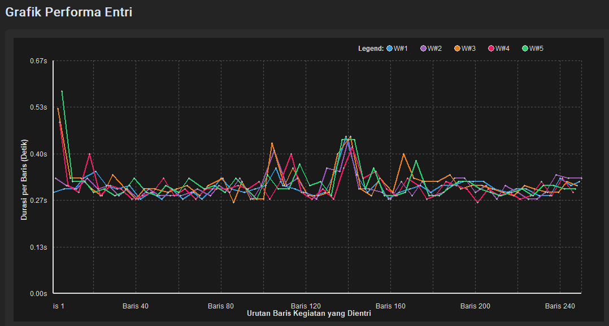

# KiPApp Helper v3

Masih pake versi 2? Ga mau pindah ke versi ini yang berkali lipat lebih cepat? Gapapa, emang ga semua siap dengan perubahan.

FYI, kalo v2 bisa entri satu baris SKP anda dalam **10 detik**, v3 ini cuma butuh **0.4 detik/baris**.

Ini ga bohong. Bisa dilihat di bawah ini, di mana ketika aku mensimulasikan entri 250 baris, speed nya konstan antara 0.2-0.5 detik.

Masih gak mau pindah ke v3? Yaudah.

---

## Update

Pada pembaruan versi **3.2607.01.lt**, kami menambahkan fitur penyuntingan langsung (*in-place editing*) dengan dobel klik pada sel tabel kegiatan, penandaan warna merah dinamis untuk baris dengan Rencana Kinerja (RK) yang belum terpetakan, serta validasi entri otomatis yang kini hanya memproses baris kegiatan terpilih yang dicentang.

| Versi | Perubahan / Changelog |
| :--- | :--- |
| **3.2607.01.lt** | • Fitur klik 2x sel tabel kegiatan untuk menyunting secara langsung (*in-place*). • Baris dengan Rencana Kinerja (RK) belum terpetakan diwarnai merah dinamis. • Proses entri hanya memproses baris kegiatan terpilih yang dicentang (dilengkapi validasi peringatan jika kosong). • Dukungan pencocokan nama RK otomatis berbasis teks/string agar lebih fleksibel. • Perbaikan bug minor dan efisiensi memori. |
| **3.2606.30.blt** / **3.2606.30** | • Perbaikan *bug* kegagalan menghapus tampilan tabel SKP. • Perampingan codebase untuk meningkatkan performa. |
| **3.2606.11.lt** | • Perbaikan penyesuaian pelebaran kolom. |
| **3.2605.29.lt** | • Mengganti versi utama untuk meningkatkan stabilitas sistem. |
| **3.2605.25.lts** / **3.2605.25.lt** | • Perbaikan kesalahan fatal terkait pembukaan ekspos kode. • Perbaikan bug umum. |
| **3.2605.20** / **3.2605.21** | • Penambahan aturan validasi data. • Perbaikan bug umum. |
| **3.2605.17** | • Dukungan impor dari spreadsheet. • Peningkatan pengalaman pengguna (UX). • Metode pembaruan aplikasi yang lebih mudah. |
| **3.2605.09** / **3.2605.10** | • Rilis awal KiPApp Helper v3. • Perbaikan minor dan dokumentasi. |

---

## Persiapan
Saya asumsikan anda lanjut membaca karena ingin pindah ke versi 3. Here we go.
1. Download dan instal Python (kalo anda pengguna KiPApp Helper versi 2, gausah instal lagi)
2. Download KiPApp Helper v3 versi ZIP dari GitHub, lalu ekstrak.
3. Siapkan excel SKP dengan 10 kolom urut dari kiri. Yang tidak wajib berarti boleh kosongan.

| Kolom | Judul | Wajib | Aturan isi |
|---:|---|:---:|---|
| 1 | Start Date | Ya | Tanggal. Aplikasi akan mengubahnya jadi `YYYY-MM-DD`. |
| 2 | End Date | Tidak | Tanggal. Isi hanya bila memakai rentang tanggal. Jika kosong, tetap kosong. |
| 3 | Jam Mulai | Tidak | Jam. Aplikasi akan mengubahnya jadi `HH:MM`. Isi hanya bila memakai rentang jam. |
| 4 | Jam Selesai | Tidak | Jam. Aplikasi akan mengubahnya jadi `HH:MM`. Isi hanya bila memakai rentang jam. |
| 5 | Rencana Kinerja | Ya | Isi nomor RK (misal: `1`, `2`) atau teks literal RK (misal: `Meningkatnya...`) sesuai tabel di aplikasi. Nanti klik `Ubah RK`. |
| 6 | Kegiatan | Ya | Minimal 10 karakter. |
| 7 | Capaian | Ya | Minimal 10 karakter. |
| 8 | Progres | Ya | Isi 1-100. Biasanya 100. |
| 9 | Link Bukti | Ya | Isi link bukti dukung. |
| 10 | Centang | Ya | Isi 1 bila masuk capaian SKP, 0 bila tidak. Biasanya 1. |

Format tanggal yang aman: `YYYY-MM-DD`, `DD-MM-YYYY`, `DD/MM/YYYY`, `YYYY/MM/DD`, `DD.MM.YYYY`, `YYYYMMDD`, atau format tanggal asli Excel.
Format jam yang aman: `HH:MM`, `H:MM`, `HH.MM`, `H.MM`, `HHMM`, angka jam seperti `8`, atau format jam asli Excel.
> Pro tips: sebelum impor, pas masih di excel/spreadsheet, konversi kolom tanggal menjadi format tanggal dulu, biar ga eror pas impor.

---

## Instalasi
1. Download ZIP KiPApp Helper v3 dari GitHub.
2. Ekstrak ZIP ke folder yang anda mau.
3. Jalankan aplikasi sesuai sistem operasi anda:
   - **Windows:** Klik 2x berkas `run.bat`.
   - **macOS:** Klik 2x berkas `run.command`. *(Jika muncul kendala izin/permission, jalankan `chmod +x run.command` di Terminal sekali saja).*
   - **Linux:** Jalankan `./run.sh` di Terminal. *(Pastikan sudah menjalankan `chmod +x run.sh` terlebih dahulu).*
4. Jendela KiPApp Helper v3 akan terbuka.
5. Buka file env, isi username dan password SSO anda. Lalu simpan dan edit namanya menjadi ".env"
pake titik di depannya.

> [!NOTE]
> Anda tidak perlu pusing instal dependensi manual. Cukup jalankan berkas peluncur sesuai OS anda (`run.bat` / `run.command` / `run.sh`), dan aplikasi akan otomatis menyiapkan semuanya untuk anda.

---

## Panduan Penggunaan
1. Saya asumsikan udah ada .env berisi SSO BPS anda. klik "impor SSO".
2. Klik login. Pop-up OTP akan muncul bila SSO anda menggunakan OTP. Login berhasil ditandai dengan pesan log "Login sukses!" dan
tombol logout merah muncul.
3. SKP dan RK akan dimuat otomatis setelah login. Pilih SKP yang akan anda entri dari dropdown. Pastikan sudah membuat wadah periodiknya di KiPApp.
> Saya berencana menambahkan fitur pembuatan wadah periodik ini, tapi nanti ketika tidak malas.
4. Perhatikan bahwa baris-baris RK memiliki nomor di kolom "No.".
5. Buka Excel SKP anda yang sudah disiapkan. Isi di kolom Rencana Kinerja dengan nomor RK atau teks literal RK sesuai di KiPApp Helper. Simpan.
6. Impor Excel SKP tersebut ke aplikasi dengan klik "Impor Kegiatan". 
7. Akan muncul tombol "Ubah RK". Klik untuk mengubah angka-angka RK di SKP anda yang mau dientri dengan RK yang sesungguhnya. KiPApp Helper akan otomatis mengubahnya.
8. Pastikan kolom berbintang sudah diisi semua, dan isian sudah benar. Siap entri? klik tombol biru "Entri".
9. Bila SKP anda berjumlah 100 baris, estimasi saya tidak akan sampai 10 detik seluruhnya sudah terinput ke KiPApp. Bisa dilihat di pesan log, berapa lama entri KiPApp anda berjalan.
10. Silakan buka browser anda dan login ke KiPApp, buka periode SKP yang barusan anda entri. SKP anda sudah terentri seluruhnya kan?
11. (Opsional) Klik tombol logout dan tutup aplikasi. 

Sekarang tau kan, bahwa kecepatan entri KiPApp Helper v3 **sangat sangat brutal**? Bikin v2 terasa seperti alat purba. Sudah, tutup mulut anda yang menganga itu.

---

## QnA
Silakan ke [QnA KiPApp Helper](https://s.bps.go.id/kipapp-helper-qna)  untuk bertanya jawab.

---

## FAQ

| Pertanyaan | Jawaban |
|---|---|
| **Apakah ini aman untuk SSO? Mengingat loginnya butuh SSO?** | Sangat aman dari ekspose ke pihak luar, termasuk ke saya sendiri. Saya tidak mencantumkan method apapun untuk mencuri SSO anda—buat apa? SSO saya sendiri sudah cukup membuat pusing. |
| **Apa jaminan bahwa SSO saya (pengguna) pasti aman?** | Kode saya sangat mudah dibongkar. Silakan dibongkar dan dicari bagian mana yang anda curigai melakukan pencurian SSO anda. |
| **Apa motivasi anda (developer) mengembangkan aplikasi ini, bila anda tidak berniat mencuri data pegawai lain maupun tidak memonetisasi?** | Cuma sekedar berbagi kebahagiaan. Saya pusing entri SKP satu-persatu manual, maka saya membuat alat ini. Mau tidak pusing juga? Ayo pake alat saya juga. Harapannya sih pusing anda berkurang. Saya hepi, anda hepi juga. Ga mau karena trust issue? Yasudah, ga maksa. |
| **Bisakah kami review kode bersama anda?** | Bisa. Baik untuk kepentingan satker maupun pribadi, silakan kontak saya terlebih dahulu untuk janjian tanggal dan waktunya. |

---

## Kompatibilitas Versi Python
Aplikasi ini mendukung versi Python 3.12, 3.13, dan 3.14. Gausah repot-repot hapus versi python anda
demi mencocokkan versi pengembangan saya yang menggunakan python 3.12.7 ini. Pokoknya,
`main.py` akan pintar mendeteksi versi Python yang anda gunakan dan menjalankan modul yang paling sesuai.

---

## Lisensi
Hak Cipta © 2025 Gilang Wahyu Prasetyo, BPS Kabupaten Tabalong.  
Seluruh hak cipta dilindungi undang-undang. Penggunaan perangkat lunak ini tunduk pada ketentuan dalam file [LICENSE](LICENSE).
